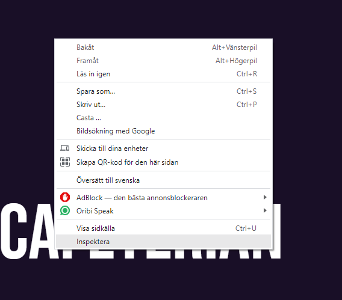
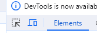
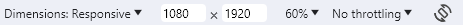

# Cafeteria display

## Introduction

This project is a raspberry pi driven "Cafeteria display" which runs a website with the café´s opening hours, items and menu.

[Link to Google Drive](https://drive.google.com/drive/folders/1Yf2ABcoPqGIK5E88mXdyQchkGVjTMYVt)

This project is based on a 1080 x 1920 resolution 

To view the website on this resolution use the inspect tool by pressing right click on website

Then click on this icon to change to your desired resolution

Then change to the right resolution

## Useful configuration tips

[Tips](Documentations/configuration.md)

## Licence

[Licences](Documentations/licence.md)

## Tests

There is automated tests made with selenium. 

[Tests](Documentations/tests.md)

## Getting started with the Raspberry Pi
[Instructions](Documentations/raspberrySetup.md)

[Using Raspberry pi](Documentations/usingRaspberryPi.md)

[Autostart](Documentations/autostart.md)

***

## Environments and Languages 
[Documentation](Documentations/enviromentsLanguages.md)

***
